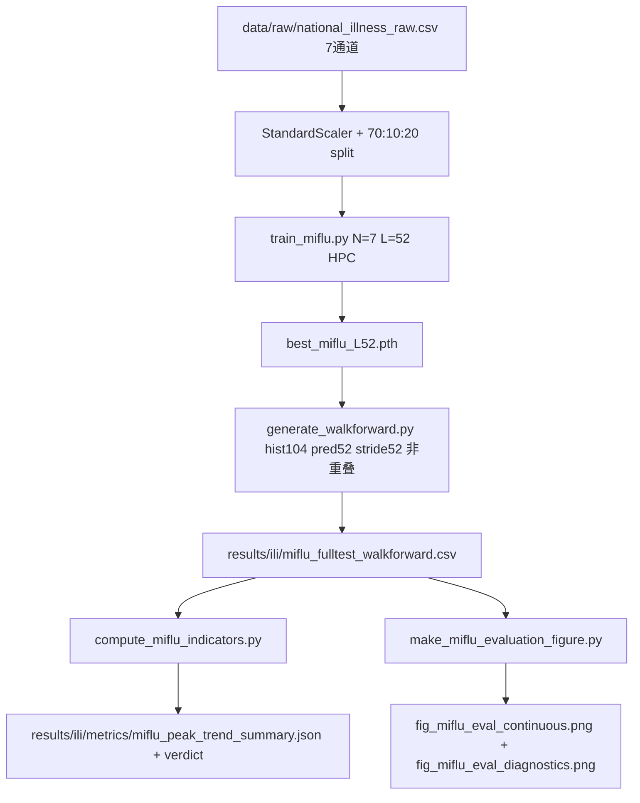

## 用户需求

将 MIFlu 重构为与 ChatTime **完全相同的文件夹布局与评估协议**，使 National ILI 的复现结果可直接与 ChatTime 基线头对头对比（2 张图 + 1 个 verdict md + 4 个指标）。本轮同时**逆转上一轮的 OT 清理决策**：恢复 N=7 架构，OT 作为第 7 通道（= `num_patients` 总门诊量/分母，StandardScaler 中性化尺度），并在文档如实标注为 black-box best guess。

## 产品概述

- **STEP A 结构镜像**：建立 `scripts/`、`data/raw/`、`data/ili/`、`results/ili/{figures,metrics,pc_results}/`、`docs/`；根保留 `MIFlu 复现障碍分析.md` 作为 PROJECT_STATE 角色。
- **STEP B 清理**：删除旧单窗口输出、旧 `hpc_results/*`、临时/中间脚本与重复 csv；保留下载脚本、训练脚本、checkpoints、新 walk-forward/indicator/figure 脚本、原始数据、docs。
- **STEP C 恢复 N=7**：7 通道含 OT，文本 prompt 含全部 7 变量描述。
- **STEP D 采用 ChatTime walk-forward 协议**：hist=104, pred=52, stride=52, 非重叠, 70:10:20 切分；重训 MIFlu 用 L=52, N=7；发 HPC SLURM 任务（不本地训）；推理产出单连续 CSV `results/ili/miflu_fulltest_walkforward.csv`。
- **STEP E 指标/图/verdict**：复用上一轮已建的 OT-free 指标与图脚本（改为读取单一 L=52 walk-forward CSV），输出 2 图 + verdict md/tex + 指标 csv/json，阈值与 ChatTime 一致。
- **STEP F 文档更新**：用中文大白话更新 `MIFlu 复现障碍分析.md` 的 Q1、Q6，并新增“为何 hist=104/pred=52/stride=52”问答。

## 核心功能

- 单连续 walk-forward CSV（`date, ground_truth, prediction`，ILITOTAL 目标），覆盖整个测试期，末窗口截断。
- 4 指标（Peak Hit / Timing / Peak Intensity / Direction）+ 阈值判定，镜像 ChatTime 可读名与 verdict 表（ASCII 标签）。
- 2 张出版级图（hero 连续曲线 + diagnostics 滚动方向/季节峰值误差条）。

## 技术栈

- Python 3.9 + PyTorch 2.5.1 (CUDA11.8) + transformers 4.57.6（与 HPC `mlflu_hpc` 环境一致）
- 复用现有 `miflu_model.py` / `train_miflu.py` / `textual_embedder.py`，以及上一轮已建 `scripts/compute_miflu_indicators.py` / `scripts/make_miflu_evaluation_figure.py`
- HPC：Burgundy，SLURM，`module unload default && module load old_modules`，PATH-prepend conda `mlflu_hpc`，scratch 缓存，绝对 `--output/--error`
- 不引入新依赖，不改动 ChatTime 参考（只读）

## 实现方案

### 关键决策与策略

1. **N=7 恢复（STEP C）**

- `train_miflu.py`：将 `CONFIG["N"]` 改回 7，`VAR_COLS` 恢复 7 通道（`% WEIGHTED ILI, % UNWEIGHTED ILI, AGE 0-4, AGE 5-24, ILITOTAL, NUM. OF PROVIDERS, OT`），`build_prompt` 改回 `build_prompt`（7-var，含 OT var 7 描述）。
- `textual_embedder.py`：保留现有 `PROMPT_TEMPLATE_7` + `build_prompt`（已含 OT）；`VAR_COLS` 保留 7-var 注释。OT 注释与 doc 行明确写：`OT ≈ 缩放后的总门诊量/分母 (num_patients; black box, best guess)`。
- 不重缩放：StandardScaler 对常数缩放不变，OT 尺度不影响训练。

2. **Walk-forward 协议（STEP D，核心）**

- 新增/重写 `scripts/generate_walkforward.py`：单 L=52 非重叠 walk-forward，**精确镜像** ChatTime `run_ili_walkforward.py` 的 `walk_forward_windows`（hist=104, pred=52, stride=52, 70:10:20, 末窗口 `min(pred_len, remain)` 截断）。
- 数据：`national_illness_raw.csv` 7 通道，epiweek→date 用 `datetime.fromisocalendar(y, w, 1)` 映射（与上一轮指标/图脚本一致）。
- 推理加载 N=7 的 `best_miflu_L52.pth`，逐窗口滑过整个测试期，拼接成连续 `date, ground_truth, prediction`（ILITOTAL 物理值，clamp≥0）。
- 输出路径：`results/ili/miflu_fulltest_walkforward.csv`（**注意：不是 per-horizon**）。

3. **训练脚本改造（STEP D）**

- `train_miflu.py` 已支持 `--horizon`（=L）。新增默认 L=52 路径：提供 `train_q1_L52.sh`（或复用现有模板改 `--horizon 52`），顺序提交避免并发 NaN。
- 现有 `best_miflu_L{24,36,48,60}.pth` 保留为历史（L≠52，不被新协议使用），新产 `best_miflu_L52.pth`。

4. **指标/图脚本（STEP E）**

- 上一轮 `compute_miflu_indicators.py` / `make_miflu_evaluation_figure.py` 已基本 OT-free 且支持任意 walk-forward CSV；只需将默认输入指向 `results/ili/miflu_fulltest_walkforward.csv`，输出名保持 `miflu_` 前缀（`miflu_verdict_table.md/.tex`, `miflu_peak_indicators.csv`, `miflu_peak_trend_summary.json`）。
- 4 指标与阈值（Peak Hit≥0.75, Timing≤2.0, Peak Intensity≤20.0, Direction≥0.60）已对齐 ChatTime；可读名映射沿用 ILI_FOUR_INDICATORS.md。
- 图遵循 FIGURE_STYLE_GUIDE.md：hero ~7in 300DPI + diagnostics ~13in 2panel + verdict 真实表格（md/tex，ASCII-only）。

5. **清理（STEP B）**

- 删除：`data/forecast_values_national_L*.csv`（不存在则跳过）、`data/fig_q1_*.png`、`hpc_results/*`、`make_forecast_figure.py`（旧单窗口出图）、上一轮合成测试产物、重复中间 csv/日志。
- 移动：`national_illness_raw.csv` → `data/raw/`；上轮 `results/ili/*` 中间物归并；docs 新建 MIFlu 版 `ILI_FOUR_INDICATORS.md` / `FIGURE_STYLE_GUIDE.md`。

### 性能与可靠性

- HPC 训练 L=52 × 10 rep × 20 ep，单 horizon 约 15–30 分钟；顺序提交避免并发竞态（历史已证并发致 NaN 权重）。
- NaN-rep 丢弃 + gradient clipping（clip=1.0）沿用，保证权重稳定。
- walk-forward 推理覆盖全测试期非重叠窗口，末窗口截断无 padding，避免边界伪造。
- py_compile 全部脚本；HPC 重训前 scp 完整新版脚本（burgundy.hpc.cityu.edu.hk 完整域名）。

### 实现注意事项

- `generate_walkforward.py` 必须处理 epiweek→date（ChatTime 用 `date` 列，MIFlu 用 `epiweek`），保持与指标/图脚本 `parse_dates` 一致。
- 推理取模型物理输出（已是 RevIN→StandardScaler→clamp 链），不与旧单窗口脚本二次逆变换混淆。
- 所有修改需 `python -m py_compile` 通过；不触碰 `C:\Users\AsDesktop\Chattime` 任何文件。

## 架构设计



## 目录结构

```
MLFlu/
├── scripts/
│   ├── download_national_illness.py      # [KEEP] 数据下载
│   ├── train_miflu.py                    # [MODIFY] N=7 + 默认 L=52 + 7-var prompt
│   ├── generate_walkforward.py           # [MODIFY] 单 L=52 非重叠 walk-forward (镜像 ChatTime)
│   ├── compute_miflu_indicators.py       # [KEEP/微调] 读单一 walk-forward CSV
│   ├── make_miflu_evaluation_figure.py   # [KEEP/微调] 输出 miflu_ 前缀
│   ├── textual_embedder.py               # [MODIFY] 恢复 7-var prompt + OT doc 行
│   └── train_q1_L52.sh                   # [NEW] HPC SLURM L=52
├── data/
│   ├── raw/national_illness_raw.csv      # [MOVE] 原始 7 通道 CDC
│   └── ili/                              # [NEW] 处理后数据(可选缓存)
├── results/ili/
│   ├── miflu_fulltest_walkforward.csv    # [NEW] 单连续 walk-forward
│   ├── figures/                          # fig_miflu_eval_continuous.png + diagnostics.png
│   ├── metrics/                          # miflu_verdict_table.md/.tex + 指标 csv/json
│   └── pc_results/                       # [NEW] 留空占位(镜像 ChatTime)
├── docs/
│   ├── ILI_FOUR_INDICATORS.md            # [NEW] MIFlu 版 4 指标
│   └── FIGURE_STYLE_GUIDE.md             # [NEW] MIFlu 版图规范
├── hpc_results/                          # [DELETE] 旧内容
└── MIFlu 复现障碍分析.md                  # [MODIFY] Q1/Q6/新 Q 中文大白话
```

## 关键代码结构

```python
# scripts/generate_walkforward.py — 核心非重叠窗口逻辑 (镜像 ChatTime)
def walk_forward_windows(y, hist_len, pred_len, stride, test_start):
    L = len(y); i = max(hist_len, test_start)
    while i < L:
        hist = y[i-hist_len:i]
        length = min(pred_len, L - i)
        if length <= 0: break
        yield hist, y[i:i+length], i, length
        i += stride

# train_miflu.py 默认配置
CONFIG = {"T":104, "L_list":[52], "N":7, "Lp":24, "S":2, "K":6,
          "lora_r":4, "D":768, "batch_size":16, "learning_rate":5e-4,
          "epochs":20, "num_repetitions":10}
```

## Agent Extensions

### SubAgent

- **code-explorer**
- Purpose: 在重构前跨文件确认所有 OT/N=6 引用点（train_miflu.py、textual_embedder.py、scripts/ 下三个脚本、make_forecast_figure.py），以及需删除/移动文件清单，避免遗漏回归。
- Expected outcome: 产出精确的文件改动与删除清单，确保 N=7 恢复与清理完整无遗漏。