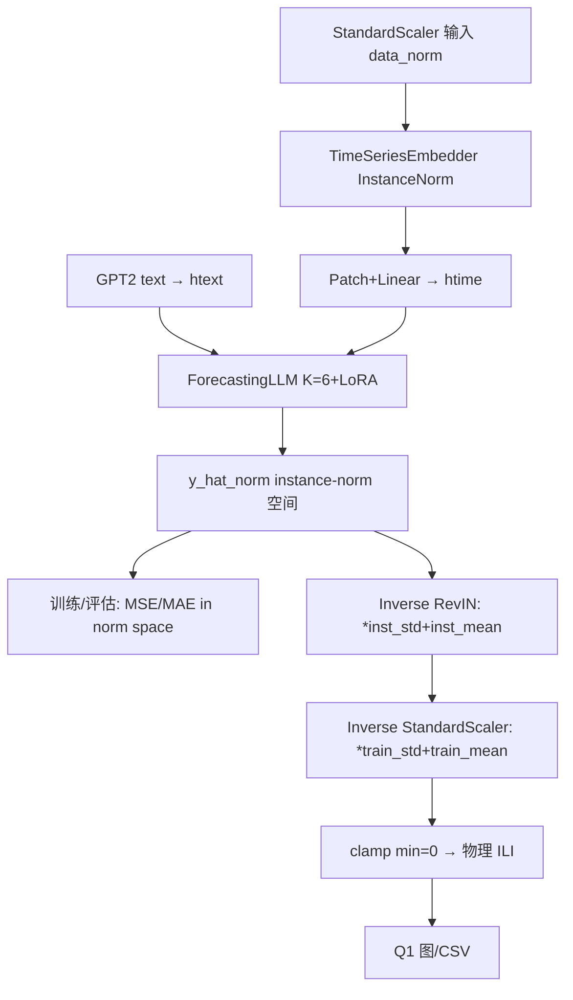

## 用户需求

根据导师要求与论文复现审计，修复 MIFlu National 任务复现差距的根因：归一化尺度 bug（StandardScaler 与 RevIN 混用导致预测系统性偏低、L=60 出现负值 ILI）。完成 Option A 修复方案并重新对齐论文 Table V。

## 产品概述

修改三处核心代码（模型逆变换链、训练评估空间、出图反归一化）使归一化数学链一致；重训 4 个 horizon（10 rep × 全 test window 均值）并加梯度裁剪与 NaN-rep 丢弃；更新 Q1 出图脚本的参考值与反变换；修正 PROJECT_STATUS 诚实标注。最终在 HPC 跑通并产出与论文同量级的归一化指标及无负值的物理空间预测图。

## 核心功能

- 修正逆变换数学链：模型输出 → Inverse RevIN（instance mean/std）→ Inverse StandardScaler（train 全局 mean/std）→ 物理 ILI 计数（截断 ≥0）。
- 训练 loss 与 Table V 指标在 StandardScaler 归一化空间计算；Q1 图/CSV 用完全反归一化物理空间。
- 重训加 gradient clipping + NaN-rep 丢弃；指标 = 10 rep 在全部 test window 的均值；单 max-ILITOTAL window 仅作 Q1 case-study 图。
- auto-check 引用 per-horizon 真实 Table V 值（来自 miflu_ground_truth.json），仅打印 ratio，不作为 pass/fail。
- 修正 prompt task instruction 与论文 Appendix Table X 完全一致（固定 104、去掉 "for the information attached"）。
- 更新 PROJECT_STATUS §7.2 诚实标注（移除错误 0.525/0.393，记录 1.542 vs 实测，注明 lr/epochs 未披露导致无法逐位复现）。

## 技术栈

- Python 3.9 + PyTorch 2.5.1 (CUDA11.8) + transformers 4.57.6
- 复用现有 miflu_model.py / train_miflu.py / make_forecast_figure.py / textual_embedder.py
- HPC: Burgundy gpu_v100s 分区，sbatch 提交，conda 环境 mlflu_hpc
- 不引入新依赖，不改动架构超参（K=6, r=4, Lp=24, S=2, T=104 已匹配论文）

## 实现方案

### 关键根因与修复策略

1. **逆变换链错乱（主因）**：`MIFlu.forward` 当前用 instance mean/std 做 RevIN（`y_hat = y_hat_norm * stdevs + means`，miflu_model.py:473），而输入 `x` 是 StandardScaler 空间。模型在 instance-norm 空间学习，但 RevIN 把 instance 统计量当物理尺度还原，导致与 StandardScaler 冲突、尺度系统性偏移、L=60 出现负值。

- 修复：模型 forward 返回 **两条** —— (a) instance-norm 空间原始预测 `y_hat_norm`（供训练/评估，直接与此空间的 `Y` 目标比较，因 `Y` 同样由 StandardScaler 输入经同一 InstanceNorm 路径生成）；(b) 物理空间 `y_phys = RevIN(instance) → StandardScaler 逆变换(train m/s)`，并 `torch.clamp(y_phys, min=0)`。
- 关键：训练目标 `Y` 在 `train_miflu.py` 是 StandardScaler 空间，但进入模型后会经 InstanceNorm。需在 `TimeSeriesEmbedder` 对 `Y` 也做同样的 InstanceNorm（或让模型直接预测 instance-norm 空间，训练 loss 在 instance-norm 空间算，与论文 Section V-B「归一化空间」语义一致即可，只要训练/评估/反变换三处统一）。**最稳方案**：模型内部全程在 instance-norm 空间做预测与 loss，反变换时先 Inverse RevIN 再用 train StandardScaler 逆变换到物理空间，推理端严格按此链路。

2. **评估空间错误**：`train_miflu.py evaluate` 在 RevIN 物理空间算 MSE，违反约束。改为在模型返回的 instance-norm 空间预测与 `Y`（同空间）上算 MSE/MAE，与论文 Section V-B 对齐。
3. **指标协议**：`main` 当前只保留 best-val 单 rep。改为 10 rep 全 test window 均值作为最终 Table V 指标；NaN/inf rep 丢弃不计入。
4. **出图双重逆变换**：`make_forecast_figure.py` 当前 `pred_raw = yh*s+m` 对已是物理空间的 `yh` 二次逆变换。改为直接取模型物理空间输出（已含完整逆链），仅做 `clamp(min=0)`。
5. **参考值**：删除 `TABLE_V_NATIONAL_MSE_REF=0.525/0.393`，改为 per-horizon dict（值取自 miflu_ground_truth.json table_V_national_results），auto-check 仅打印 ratio。

### 性能与可靠性

- 训练为 HPC GPU 作业，每 horizon 10 rep × 20 ep，约 10–25 分钟/horizon，4 horizon 顺序提交避免并发竞态（历史已证并发导致坏权重 nan）。
- NaN-rep 丢弃防止坏权重污染均值；gradient clipping（clip_grad_norm_=1.0）提升稳定性。
- 反变换链统一后，L=60 负值问题应消除；若仍出现，clamp(min=0) 兜底。

### 实现注意事项

- 保持 `MIFlu.forward(x, htext)` 签名兼容，新增返回 `y_hat_norm`（训练用）与 `y_phys`（推理用），或返回 tuple 由调用方选。
- `train_miflu.py` 的 `evaluate` 需接收 norm 空间预测；`train_epoch` loss 同样在 norm 空间。
- `make_forecast_figure.py` 加载 checkpoint 后推理取 `y_phys`，CSV/图用物理值，normalize 指标用 `y_hat_norm` 与 `Yte`（需推理时同时拿到 norm 空间）。
- prompt 修正：task instruction 改为 `"Predict the next {L} steps given the previous 104 steps."`（去掉 "for the information attached"，{T} 硬编码 104）。
- 所有修改 `python -m py_compile` 通过；HPC 重训前先 scp 完整新版脚本（用 burgundy.hpc.cityu.edu.hk 完整域名）。

## 架构设计



## 目录结构

```
MLFlu/
├── miflu_model.py              # [MODIFY] MIFlu.forward 返回 (y_hat_norm, y_phys)；ForecastingLLM 返回 norm 空间；加 clamp
├── train_miflu.py              # [MODIFY] evaluate/train_epoch 在 norm 空间算 loss；main 加 grad clip + NaN-rep 丢弃 + 10rep 均值；日志记 norm MSE/MAE
├── make_forecast_figure.py     # [MODIFY] 取模型物理输出（去双重逆变换）；TABLE_V 改 per-horizon dict；auto-check 打印 ratio；保留 nan_to_num 防御
├── textual_embedder.py         # [MODIFY] PROMPT_TEMPLATE task instruction 改为论文 Appendix Table X 原文
├── PROJECT_STATUS.md           # [MODIFY] §7.2 诚实标注：移除 0.525/0.393，记 1.542 vs 实测，加成功定义与 lr/epochs 局限
└── train_q1_L24/36/48/60.sh    # [MODIFY/确认] SBATCH 脚本已存在，重训时复用（绝对 PATH + 绝对 log 路径）
```

## 关键代码结构

```python
# miflu_model.py — MIFlu.forward 新返回契约
def forward(self, x, htext, means=None, stdevs=None):
    htime, means, stdevs = self.time_embedder(x, means, stdevs)
    y_hat_norm = self.forecasting_llm(htime, htext)   # instance-norm 空间
    y_rev = y_hat_norm * stdevs + means               # Inverse RevIN
    y_phys = y_rev * self.train_std + self.train_mean # Inverse StandardScaler (train only)
    y_phys = torch.clamp(y_phys, min=0.0)
    return y_hat_norm, y_phys
```

## Agent Extensions

### SubAgent

- **code-explorer**
- Purpose: 在修改前跨文件确认逆变换链所有调用点（miflu_model.py / train_miflu.py / make_forecast_figure.py 中 yh 的使用），避免遗漏双重逆变换或 norm 空间误用。
- Expected outcome: 产出所有需修改的精确行号与调用上下文清单，确保修改完整无回归。