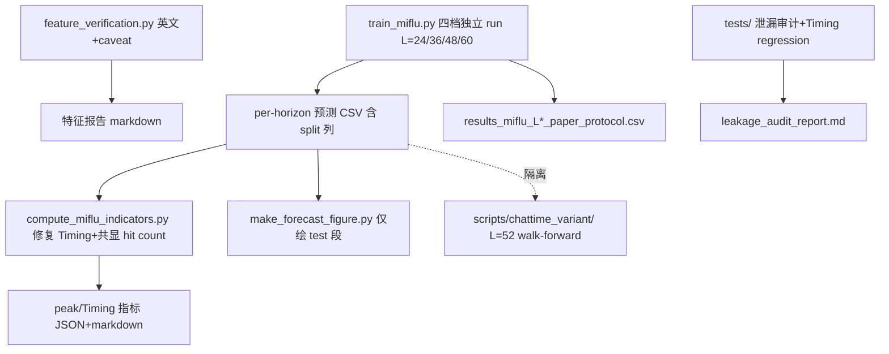

## 用户需求概述

复现 MIFlu（IEEE JBHI 2025）全国流感预测方案，并依据 Fix Brief 修正此前偏离论文协议的管线，使产出严格对齐论文 Table V，且所有交付物英文化以面向顶刊投稿。

## 核心功能

1. **协议修正（最高优先级）**：将训练/评估切回论文协议——历史窗口 T=104，预测 horizon L∈{24,36,48,60} 四档独立训练与评估（非滚动 52 周窗口），静态时间序 70:10:20 切分（shuffle=False），patch Lp=24/S=2，GPT2 前 K=6 层 + LoRA r=4 仅作用于 attention，位置编码与 LayerNorm 冻结，StandardScaler 仅 fit 训练集，每 horizon 10 次重复取均值。L=52 walk-forward 管线隔离至 `chattime_variant/`，不作为默认路径。输出文件按协议重命名避免混淆。
2. **数据泄漏自审计**：预测输出 CSV 增 `split` 列（train/val/test），绘图严格过滤 `split=='test'` 且代码中断言；新增单元测试保证测试窗口目标起点严格在 train+val 索引之后、Scaler 仅用训练集 fit；产出英文泄漏审计 markdown（索引范围、scaler fit 边界代码、无 shuffle 证明）；审计通过后，左拟合好/右退化差解释为 COVID-19 分布偏移（合法泛化失败）。
3. **Timing 指标 bug 修复**：Timing 与 Peak Intensity 仅对通过 Peak Hit 的峰计算，且报告始终共显 Peak Hit 计数（如 "1/4 peaks matched"）；确认 GT 与预测使用相同 find_peaks 参数；新增 regression test 用合成不重叠峰序列验证 Timing 正确反映非零偏移或报 NaN/"unmatched" 而非默认 0。
4. **特征重要性归因警示**：RF/SHAP 打印与报告自动追加 caveat（统计关联非因果、PROVIDERS/OT 受上报规模效应影响）；Granger 明确标注 "Granger causality (temporal precedence + statistical association)"，不单称 "causal"；报告转英文。
5. **交付物清单**：4 张英文结果表（MSE/MAE/RMSE/PCC，10-run mean±std）、带 split 列预测 CSV、泄漏审计 markdown、修复后 peak/Timing 指标、带 caveat 的特征报告、已知局限 README 段（lr/epochs 未披露、无官方代码/数据快照、不声称逐位复现）。

## 产品视觉（报告/图表）

所有表格、图注、轴标签、图例、标题、代码注释与 docstring 一律英文；泄漏审计与特征报告为英文 markdown；预测曲线图仅绘 test 段并标注 COVID-19 分布偏移说明。

## 技术栈

- 语言/框架：Python 3.9 + PyTorch 2.x + Transformers (GPT2) + scikit-learn + statsmodels + scipy + matplotlib + pandas。
- 复用现有：`miflu_model.py`（MIFlu 模型）、`textual_embedder.py`（GPT2 文本嵌入，已逐字对齐论文）、`train_miflu.py` / `compute_miflu_indicators.py` / `feature_verification.py` 现有管线、pytest 单测体系（`tests/`）。
- 不引入新依赖；Phase 2 `chattime_variant/` 仅规划目录与接口占位，不实现训练。

## 实现方法

### 1. 协议修正（Brief #1）

- 修改 `train_miflu.py`：`CONFIG["L_list"]` 由 `[52]` 改为 `[24,36,48,60]`；移除 walk-forward 概念，四档独立 run 已天然支持（循环 `for L in L_list` 各自训练/评估/存 `best_miflu_L{L}.pth`）。
- `build_windows` 保留滑动窗口，但需显式返回每窗口的 `split` 标签数组（0/1/2）并写入结果，便于审计；切分边界 `splits[i] = 0 if (i+T) < train_end else ...` 已正确，无需改逻辑，仅暴露元数据。
- 输出文件名改为 `results_miflu_L{24,36,48,60}_paper_protocol.csv`（带时间戳防覆盖），并在日志声明协议。
- 将 `generate_walkforward.py` 整体移至 `scripts/chattime_variant/`，原 `scripts/` 下保留一个薄转发说明或删除；更新 `PROJECT_STATUS.md` 标注其非默认路径。

### 2. 数据泄漏自审计（Brief #2）

- 在 `train_miflu.py` 评估环节为每条预测记录附加 `split` 列（train/val/test）输出到 per-horizon 预测 CSV；绘图脚本（如 `make_forecast_figure.py` 及指标脚本）读取时断言仅用 `split=='test'` 并显式 `assert (df['split']=='test').all()` 或过滤后断言非空。
- 新增 `tests/test_leakage_audit.py`：(a) 索引边界测试——构造数据验证测试窗口目标首索引 `> v_end`；(b) Scaler 不变性测试——`Scaler.fit` 仅用 train 段，`mean_`/`scale_` 在含/不含 val/test 时一致；(c) 无 shuffle 测试——验证切分顺序与原始索引一致。
- 产出 `docs/leakage_audit_report.md`（英文），含 train/val/test 索引范围、scaler fit 边界代码片段、无 shuffle 证明；通过后将左拟合好/右退化解释为 COVID-19 分布偏移。

### 3. Timing bug 修复（Brief #3）

- 修改 `compute_miflu_indicators.py`：`compute_peak_indicators` 的 `mean_abs_delta_t`/`mean_peak_magnitude_rel_err_pct` 仅在 hit 峰计算（现状已如此），但 **verdict 输出与 summary 必须强制共显 `n_hit`/`n_true`**（如 `"peak_hit_count": "1/4"`）；JSON/打印均显式包含。
- 锁定 `detect_peaks` 的 prominence/distance 对 GT 与 pred 一致（当前一致，加测试固化）。
- 新增 `tests/test_timing_metric.py`：合成序列 GT 峰与 pred 峰不重叠 → 断言 Timing 正确反映非零偏移或在无 hit 时返回 NaN/"unmatched"，绝不默认 0.0。

### 4. 特征归因警示（Brief #4）

- 修改 `feature_verification.py`：Granger 表头/结论加限定语 "Granger causality (temporal precedence + statistical association)"；RF/SHAP 章节与终端打印自动追加 caveat 文本（统计关联非因果、PROVIDERS/OT 受上报规模影响）。
- 报告全文转英文（标题、表头、解读、QA 文档）。

### 5. 交付物与英文化（Brief #5）

- 4 张结果表英文列头（Horizon, MSE, MAE, RMSE, PCC, Mean±Std），由 `train_miflu.py` 与指标脚本产出。
- 预测 CSV 带 `split` 列（见 #2）。
- 泄漏审计 markdown（见 #2）、修复后 peak/Timing 指标（见 #3）、带 caveat 特征报告（见 #4）。
- 新增/更新 `README.md` 已知局限段：lr/epochs "set empirically" 未披露、无官方代码/数据快照、不声称逐位复现，目标为量级与定性趋势匹配。

## 实现注意事项

- **向后兼容**：`best_miflu_L{L}.pth` 机制已存在，四档独立 run 直接复用，不破坏现有 checkpoint 加载。
- **性能**：四档独立 run 训练成本 ×4，但每档窗口数减少（L 越小窗口越多），总体可控；HPC 作业仍按 L 分提交（现有 `train_q1_L*.sh` 可复用，仅需确认 L_list 生效）。
- **日志**：复用现有 `log()`，避免敏感信息；审计测试用 pytest 断言，不依赖 HPC。
- **爆炸半径控制**：仅修改上述指定文件，不动 `miflu_model.py`/`textual_embedder.py` 逻辑；`chattime_variant/` 仅移动文件 + 占位，不影响 MIFlu 默认路径。

## 架构设计



## 目录结构

```
MLFlu/
├── scripts/
│   ├── train_miflu.py              # [MODIFY] L_list=[24,36,48,60] 四档独立 run；输出重命名 paper_protocol.csv；build_windows 暴露 split 标签
│   ├── compute_miflu_indicators.py # [MODIFY] Timing 仅 hit 峰计算；verdict/summary 强制共显 n_hit/n_true；find_peaks 参数锁定
│   ├── feature_verification.py      # [MODIFY] Granger 加限定语；RF/SHAP 追加 caveat；报告转英文
│   ├── make_forecast_figure.py      # [MODIFY] 读取 split 列，断言仅 test 段绘图
│   ├── chattime_variant/            # [NEW] 由 generate_walkforward.py 移入，L=52 walk-forward 隔离路径（含 __init__/README 占位）
│   └── generate_walkforward.py      # [DELETE/MOVE] 移出默认路径至 chattime_variant/
├── tests/
│   ├── test_revin_math.py           # [KEEP] 现有
│   ├── test_leakage_audit.py        # [NEW] 索引边界/Scaler 不变性/无 shuffle 断言
│   └── test_timing_metric.py        # [NEW] 合成不重叠峰 Timing regression
├── docs/
│   └── leakage_audit_report.md      # [NEW] 英文泄漏审计（索引范围+scaler 边界+无 shuffle）
├── results/
│   └── ili/                         # [MODIFY] 预测 CSV 含 split 列，test-only 绘图
├── data/
│   └── results_miflu_L*_paper_protocol.csv  # [NEW] 重命名输出
└── README.md                       # [MODIFY] 已知局限段（英文）
```

## Agent Extensions

### SubAgent

- **code-explorer**
- Purpose: 在生成详细方案前，跨多文件确认 `build_windows` 切分边界、`make_forecast_figure.py` 现有绘图逻辑与 split 过滤点、以及 `chattime_variant/` 移动影响范围。
- Expected outcome: 输出精确的待改函数行号与依赖关系，避免计划遗漏调用点。