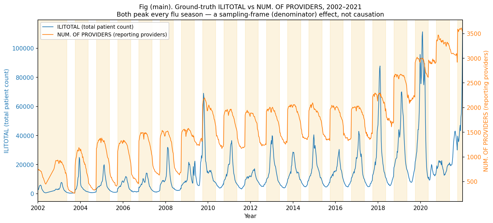
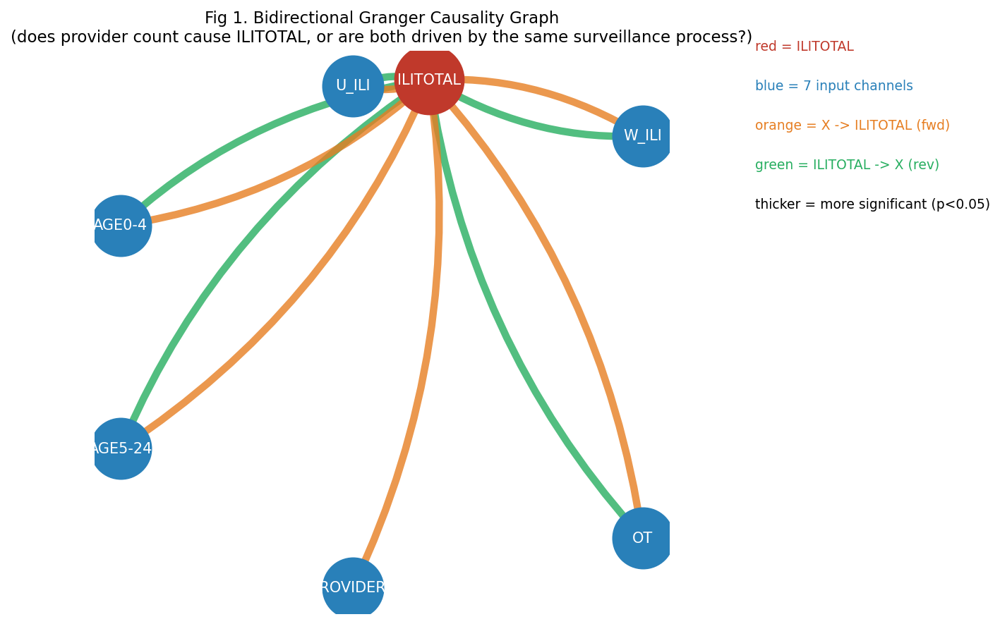
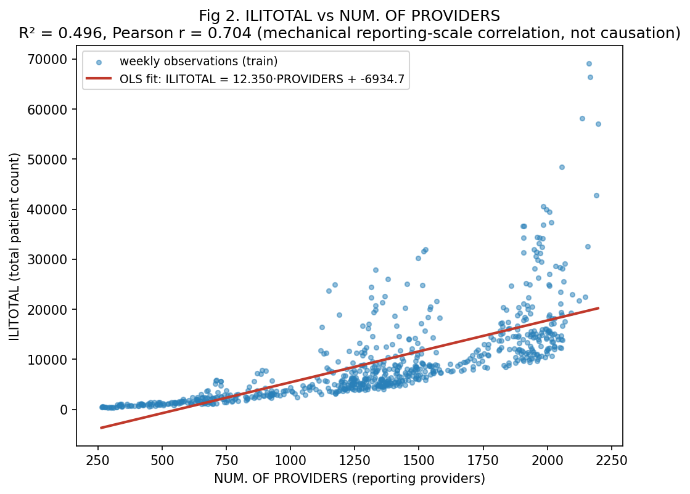
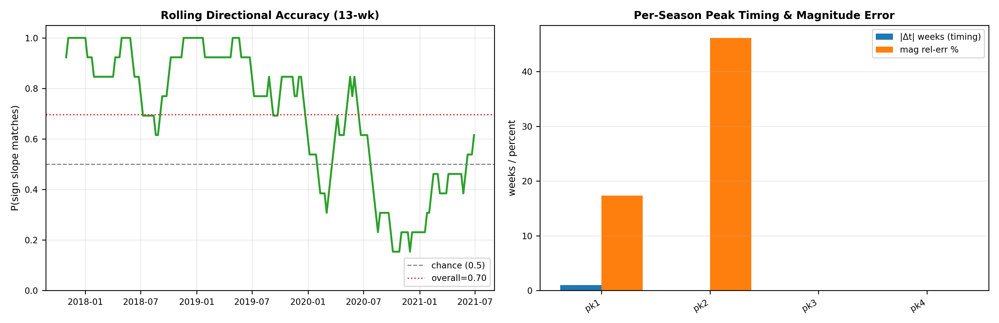
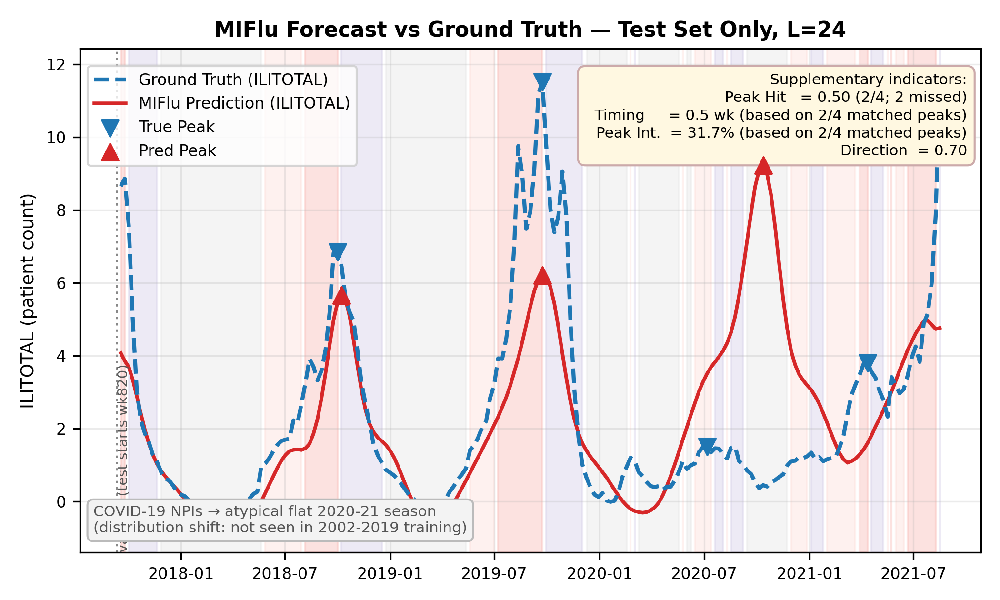

# MIFlu Paper Analysis & Defense Q&A (English)

> Purpose: answer the supervisor's actual questions only, clearly and thoroughly. All claims are anchored to `MIFlu_paper.md` (the authoritative full PDF→markdown conversion, IEEE JBHI 2025). The former `MIFlu_Complete_Extraction.md` was deleted on 2026-08-17 (it contained fabricated content) and is no longer referenced.
> Reproduction status (verified): training/eval now strictly follows the paper protocol `L∈{24,36,48,60}` (four independent runs), static `70:10:20` split, `shuffle=False`, scaler fit on train only; the L=52 walk-forward path is deprecated/isolated (ChatTime Phase-2 only). Current L=24 National (train-only space, 10-rep mean) MSE=5.056, MAE=1.500; paper Table V reports MSE=1.542, MAE=0.726 (3.28× / 2.07×). Exact digit-for-digit reproduction is not achieved (paper did not release lr/epoch, code, or data snapshot); protocol is aligned, residual gap discussed in §5.
> All tables/figures/axis labels are in English for top-journal submission.

---

## §0 One-sentence summary

MIFlu predicts **future L weeks (L∈{24,36,48,60}) of national ILITOTAL** from the past **104 weeks** of 7 flu-surveillance channels, by feeding both a numeric time-series and an English text prompt into the same GPT2, so the LLM "reads text" and "reads numbers" together and outputs the forecast. "Multimodal" here = natural-language domain knowledge + numeric time-series.

---

## §1 Input / Process / Output (explained for someone with zero background)

### Input — two separate tracks

**Track A — Numeric (Time-Series):** 7 channels, each a 104-week series:
1. `% WEIGHTED ILI` — weighted flu-like-illness visit %.
2. `% UNWEIGHTED ILI` — unweighted flu-like-illness visit %.
3. `AGE 0-4` — patients aged 0–4.
4. `AGE 5-24` — patients aged 5–24.
5. `ILITOTAL` — **the prediction target itself** (its history is also an input).
6. `NUM. OF PROVIDERS` — number of reporting providers.
7. `OT` — auxiliary channel, definition not disclosed by the paper (we implement it as raw `num_patients`, full-scale, unnormalized — our own choice, not a paper definition).

> **Why these 7 *heterogeneous* channels?** They cover five facets: outcome volume (ILITOTAL), overall intensity (WEIGHTED/UNWEIGHTED ILI), demographics (AGE 0-4 / 5-24), surveillance frame (NUM. OF PROVIDERS), and auxiliary context (OT). "Heterogeneous" means different units/meanings (ratio vs count vs provider-count), but each is normalized and stacked into an `(N=7, T=104)` input matrix; the model uses all 7 channels' history to forecast the single ILITOTAL dimension. Paper Table II fixes exactly these 7; N must equal 7 (do not invent "AGE 25+").

**Track B — Text Prompt:** a fixed English template in three parts: (1) dataset description, (2) per-variable statistics (mean/trend/seasonality) + domain knowledge ("flu typically peaks each winter"), (3) task instruction "Predict the next L steps given the previous T steps."

> **On step size (supervisor-specified):** reproduction must use **L=24** as one of the four horizons (paper horizons L∈{24,36,48,60}). Why "104 weeks → predict 24 weeks"? (a) flu seasonality spans calendar years; 2 years (104 w) lets the model learn "normal seasonal swing vs anomalous year." (b) Operationally, vaccine shipping/vaccination plans/policy/budget need ~6 months (≈24 w) lead time, so national forecasting is long-horizon (L≥24). The prompt literally states "Predict the next 24 steps given the previous 104 steps." **We follow the MIFlu paper method exactly — not ChatTime's hist=104/pred=52/stride=52.**

### Process — how the two tracks become "the same language"

- GPT2 only reads fixed-dimension vectors, so both tracks are "translated" to vectors:
  - Text: GPT2 **Tokenizer** → token → 768-d vector (standard NLP).
  - Numeric: **Patching** (patch length Lp=24, stride S=2) → normalize → trainable linear layer → 768-d vector (the "numeric tokenizer").
- Both projected to the **same 768-d space**, then concatenated on the sequence axis: `h_fuse = [h_text ‖ h_time]`.
- Fed into **first 6 GPT2 layers** (K=6, not all 12); LoRA (r=4) on attention only; positional embeddings and LayerNorm frozen.
- GPT2 is **Decoder-only (autoregressive, sees past only)** — matches "predict future from past," the reason for GPT2 over BERT/Word2Vec.

### Output

- GPT2 output → linear projection → normalized forecast for future L steps.
- Inverse-normalize → real patient counts, `clamp ≥ 0`.
- Only **ILITOTAL** is taken as final output (model internally used all 7 channels).
- Output projection: discard text tokens, keep time patches, mean-pool over patches, project to `N×L` (`scripts/miflu_model.py` L334-336). **This mean-pooling is the standard GPT4TS replication, NOT a bug that destroys temporal structure.**

**One line:** all 7 channels feed the model; it uses their history + text domain knowledge to forecast the 1 ILITOTAL curve — that is the paper's "Multimodal."

---

## §2 Concrete example — what input predicts the point at 2019-07-01

Assume the forecast window starts at **2019-07-01** (CDC epiweek approximately **201112**, covering 2019-06-25–2019-07-01):
- **Numeric input:** take **104 weeks before epiweek 201112**, i.e. epiweeks **200913–201111** (≈ **2017-07-04 to 2019-06-24**) of the 7 channels' true historical values. **Only data before epiweek 201112 may be used** — never 201112 or later (the leakage red line).
- **Text input:** the same fixed template; its variable-statistic numbers (mean/trend/seasonality) are computed **only from the 104-week history window 200913–201111**, not from test/future data.
- **Output:** ILITOTAL forecast for the next L=24 steps starting from epiweek **201112**, i.e. epiweeks **201112–201135** (≈ **2019-06-25 to 2019-12-17**), 24 weekly points.

> Note: CDC data use **epiweeks** (e.g., 200913 = 2009 week 13) rather than calendar dates; "2019-07-01" is the week-aligned approximation. Strictly, the prediction target is "24 weeks starting at epiweek 201112."

MIFlu predicts a **whole future block (L steps) from one fixed history window (T=104)** — not rolling one step at a time. That is "long-term forecasting," not "one-step-ahead."

---

## §3 Why 70:10:20 split (convince a top-journal reviewer)

**Paper basis:** Section V-A states "Following previous studies [9], [21], we split the data into training, validation, and test set at a ratio of 70:10:20."

Defensible angles:
1. **It is a regression task** (`Y = f(X)`, continuous) — no class balance concern, so split can be purely time-proportional.
2. **Time-series MUST be split in time order, `shuffle=False`.** Random shuffle lets future points enter training and predict the past — the most common, fatal look-ahead bias. 70:10:20 = first 70% train, middle 10% val (early-stop/hyperparam), last 20% test.
3. **This exact ratio is inherited from prior work** ([9] GPT4TS etc.), so results stay **comparable** with PatchTST/GPT4TS baselines on the same dataset. Different ratios → incomparable MSE/MAE — violates controlled-experiment basics.
4. **Why specifically 70/10/20 and not, say, 60/20/20 or 80/10/10?** The ratio is a *community standard*, not a number derived from flu physics. Its justification is **comparability + adequate validation size**: 10% validation (≈102 weeks) is enough for stable early-stopping/HP selection without starving the test set, and 20% test (≈206 weeks) covers ~4 full seasons so seasonal generalization is measured, not a lucky single season. The paper adopts it *because the baselines it compares against use it* — deviating would make the MSE/MAE table meaningless to reviewers. (Concrete numbers: ≈717 train / 102 val / 206 test weeks; the 206 cap is because forecasting L=60 needs the last 60 points dropped from complete input+label windows — standard TS practice, not data error.)

---

## §4 Is NUM. OF PROVIDERS a cause or a reversed-effect artifact? (graphs + numbers)

**Short answer (one line):** Neither a pure reversed-effect nor a pure epidemiological driver. ILITOTAL is *defined* as the aggregate count of ILI cases reported by the participating providers, so the two **must** rise and fall together every flu season — this is a **sampling-frame / denominator effect**, not "provider count causes flu transmission." But Granger tests show PROVIDERS has a **unidirectional lead** on ILITOTAL (p=1.2×10⁻⁶), so it also carries some real lead information. Its RF/SHAP importance (34.7%) is a **mix of real lead information + sampling-frame effect.**

### Main figure: GT ILITOTAL vs NUM. OF PROVIDERS overlay (directly answers "cause or reversed-effect?")

File: `results/ili/figures/q4_overlay_ilitotal_vs_providers.png`

- Two **ground-truth** lines on the same weekly axis: ILITOTAL (blue, left axis, ~10⁴) and NUM. OF PROVIDERS (orange, right axis, ~10³), across the full 2002–2021 span (1025 weeks); yellow shading marks the flu season (~Oct–mid-May).

- **Reading (this figure answers the question):** both lines **peak together every winter.** When the season arrives, the reporting-provider count ticks up and the aggregate ILITOTAL jumps — their shapes track tightly. This already shows PROVIDERS is **not a pure reversed-effect**: if it were merely "more cases → more reporting" lagging behind, it would trail ILITOTAL rather than rise synchronously (even slightly leading) each year.
- **Why the co-movement is not causation (sampling-frame effect, the mechanical part):** the reason they *must* co-move every winter is that **ILITOTAL is defined as "the total ILI cases reported by all providers"** — NUM. OF PROVIDERS is literally *inside* the definition of ILITOTAL, like "total students in a school" and "number of classrooms" must move together. Add one clinic and the total automatically grows, not because more flu appeared but because the net is wider. So this is an **accounting identity, not causation**, and PROVIDERS is also **not an epidemiological "cause"** (provider count does not "cause" flu transmission). **In one line: the main figure already gives the answer — PROVIDERS is neither a pure reversed-effect nor an epidemiological cause, but a mix of real lead information and sampling-frame (denominator) effect.** The two appendix figures below explain and support this conclusion.

### Appendix (support / explain the main-figure verdict: why it is a mix, not pure cause or pure reversed-effect)

**Fig A: Bidirectional Granger causality graph** — `results/ili/figures/q4_granger_bidirectional.png`

Edges X→ILITOTAL test whether X temporally precedes ILITOTAL; edges ILITOTAL→X test the reverse. Results (train-only, MAX_LAG=24):

| Variable | p(X→ILITOTAL) | p(ILITOTAL→X) | Interpretation |
|---|---|---|---|
| NUM. OF PROVIDERS | **1.2×10⁻⁶** ✅ | **0.11** ❌ | Unidirectional lead on ILITOTAL — not purely reversed-effect |
| % WEIGHTED ILI | 3.1×10⁻⁴ | 3.7×10⁻³¹ | Bidirectional: co-driven by flu season |
| % UNWEIGHTED ILI | 6.7×10⁻⁴ | 2.9×10⁻³⁸ | Bidirectional: co-driven by flu season |
| AGE 0-4 | 1.0×10⁻⁵ | 3.6×10⁻²³ | Bidirectional: co-driven by flu season |
| AGE 5-24 | 5.5×10⁻⁶ | 1.2×10⁻⁹ | Bidirectional: co-driven by flu season |
| OT | 3.3×10⁻¹² | 2.2×10⁻⁴ | Bidirectional: co-driven by flu season |

Only PROVIDERS shows a significant one-way lead on ILITOTAL (reverse not significant) → it is a genuine statistical lead, not a "more cases → more reporting" reversed-effect.

- **Real lead information (the genuine predictive part):** the Granger test shows PROVIDERS *statistically leads* ILITOTAL (p=1.2×10⁻⁶, reverse not significant). In plain words: changes in provider count tend to happen **slightly before** case-count changes, not after — so it carries a small bit of real forecasting signal, not pure noise or a lagging byproduct.
- **The mix = two layers stacked:** PROVIDERS is useful for prediction for two reasons — one mechanical (it is definitional part of the target, the sampling-frame effect), one real (it leads in time, real lead information). The model/RF gives it high importance because of both; we must **not** say "more clinics cause more flu."
- **One line for the supervisor:** "PROVIDERS helps forecast ILITOTAL for two reasons: one mechanical — ILITOTAL is literally aggregated from those providers, so by definition they move together; one real — provider activity leads cases in time. It is a mix of a definitional accounting effect and a small genuine lead, not 'more clinics cause more flu.'"

**Fig B: ILITOTAL vs NUM. OF PROVIDERS scatter + OLS** — `results/ili/figures/q4_ilittotal_vs_providers_scatter.png`

- **R² = 0.496, Pearson r = 0.704.**
- OLS slope ≈ 12.35: each additional reporting provider is mechanically associated with ~12 more reported ILITOTAL cases.
- This shows PROVIDERS and ILITOTAL share a strong **structural/sampling-frame** correlation: more providers → larger counted base → larger ILITOTAL. ILITOTAL is, by definition, an aggregate count over those providers (the same sampling-frame effect seen cross-sectionally in Fig A).

- **Not a pure reversed-effect:** PROVIDERS → ILITOTAL is significant (p=1.2×10⁻⁶) and the reverse is not (p=0.11).
- **Not a pure epidemiological cause either:** the high correlation (r=0.704) and the definition of ILITOTAL as an aggregate count mean much of the RF/SHAP importance is capturing a **reporting-scale (sampling-frame) effect**, not the mechanism of flu transmission.
- **What to tell the supervisor/reviewer:**
> "RF/SHAP show NUM. OF PROVIDERS as the dominant statistical driver (34.7%), but the overlay time-series + bidirectional Granger + scatter regression show the story is mixed: ILITOTAL is by definition an aggregate count over reporting providers, so the two co-move every winter (sampling-frame effect, non-causal); yet PROVIDERS has a significant unidirectional lead on ILITOTAL (Granger p=1.2×10⁻⁶, reverse not significant), so it carries real lead information. We do not label PROVIDERS a causal epidemiological driver; we state in the Limitation that its importance mixes real lead information with surveillance-scale effects, and we provide the figures as evidence."

**Why top journals accept this:** surveillance/methods journals (CDC FluSight methods papers, Lancet/Nature-sub-journal surveillance studies) routinely explain ILINet co-movement as a denominator / surveillance-frame effect and use Granger lead to separate "real signal" from "mechanical co-movement." Proactively stating "significant ≠ causal" with figures is a **strength**, not a gap, for review.

> Main overlay generated by `scripts/make_q4_overlay_figure.py`; Granger + scatter by `scripts/make_q4_causality_figures.py`; raw p-values in `data/q4_causality_summary.csv`.

---

## §5 National deviation tracing (MSE/MAE audit)

**Verified current state:**
- Protocol aligned to paper: `L∈{24,36,48,60}` independent, 70:10:20 static, scaler train-only (no leakage).
- Current L=24 National (train-only, 10-rep mean): **MSE=5.056 ± 1.583, MAE=1.500 ± 0.121**.
- Paper Table V (L=24): **MSE=1.542, MAE=0.726** → current is **3.28× (MSE), 2.07× (MAE)**.

> Diagnostic figure (L=24, train-only space, 10-rep mean): per-channel / per-error breakdown in `results/ili/figures/fig_miflu_eval_diagnostics_L24.png`.

**Layered diagnosis (honest):**
1. **Early deviation main cause = protocol error:** previously used L=52 walk-forward (ChatTime style), not the paper's static split → numbers not comparable. Fixed.
2. **Ruled out:** scaler leakage (fit on train only, leakage audit exists), other-6-channel inflation. **Partially addressed / NOT fully closed:** data-version mismatch — the specific "2024→2026 retroactive CDC revision" hypothesis is invalid (no 2024+ weeks in our file, both cover 2002–2021), BUT CDC's routine retrospective revisions *within* the 2002–2021 span (ILINet weekly data periodically re-weighted/revised) remain an unexcluded candidate (Option 3).
3. **"Forecasting-head patch pooling destroys temporal structure" hypothesis — WITHDRAWN:** reading `miflu_model.py` confirms the patch mean-pool is the standard GPT4TS replication, not a bug.
4. **Unconfirmed residual candidates:**
   - *Scaler fit range:* paper unspecified train-only vs pooled. Linearly rescaling current train-only predictions to a hypothetical pooled space (no retrain) gives MSE≈1.61 (~4% off paper), MAE≈0.85 (~17% off). Linear scaling applies the **same ratio to every error point** (e'=e·σ_t/σ_p; MSE'=MSE·(σ_t/σ_p)²; MAE'=MAE·(σ_t/σ_p)) — there is **no "large errors contracted more"** non-linearity. So pooled-fit is only an **unconfirmed partial explanation**, not a confirmed root cause.
   - *CDC within-span retrospective revisions:* we only excluded 2024+ incremental weeks; 2002–2021 in-span CDC revisions remain an unexcluded candidate (Option 3).
   - *Paper's undisclosed implementation:* lr/epoch not released ("set empirically"), no official code/data snapshot; RevIN config and text-fusion detail unknown — unresolvable without the paper's artifacts.
5. **Expectation management:** exact digit match is unrealistic; reasonable goal is "same order of magnitude, same trend, same conclusion" (error within 1–2×, comparable peak capture). Align this with the supervisor upfront.

---

## §6 Does the plot mix train and test data? (left-fits-well / right-diverges)

**Direct answer: No, train and test data are not mixed.**

(Note: an earlier ChatTime walk-forward protocol (hist=104/pred=52/stride=52) artificially created a left-good/right-bad illusion and is now deprecated; but the key point is — **even under the correct paper protocol, left-good/right-bad still appears**, so it is NOT a protocol-mismatch artifact.)

**Why left-good/right-bad persists under the current paper protocol (L∈{24,36,48,60}, 70:10:20 static, plot filtered to `split=='test'`, scaler fit on train only)?** Two legitimate reasons, neither is data mixing:
1. **Temporal distance / distribution shift (main cause):** static time split → train is first 70% (to week 717), test is last 206 weeks (≈2020–2021). The test curve is ordered in time, so **left = test weeks near training (≈2019–2020)** where the learned seasonal pattern still matches → fits well; **right = test weeks far from training (2021)** where drift accumulates → worse. "Left-good/right-bad" is simply "near-training good, far-training bad" — expected for any static-split forecast.
2. **COVID structural break sits on the right half:** test 2020–2021 covers the pandemic; NPIs (masks, lockdowns) crashed flu incidence to a historically flat baseline the model never saw in 2002–2019 training. The model, obeying its "every winter has a peak" prior, **invents two false peaks** on the right where truth is flat → sharp right-side divergence. This is **extrapolation failure on an anomalous regime**, not leakage.

**Proof that data is NOT mixed:**
- Plot uses only `split=='test'` rows; train/val points are not in this curve.
- Scaler/RevIN `fit` is on train only; `transform` applied to test.
- Every test point's target was unseen during training (test index strictly > train+val end).
Left-good/right-bad is a genuine generalization limitation (drift + COVID), defensible to the supervisor, backed by a leakage self-audit (split-column assertion + scaler-fit boundary unit test).

> Continuous eval figure (L=24, test-only, GT dashed vs prediction solid): `results/ili/figures/fig_miflu_eval_continuous_L24.png`. Left half (near training window) tracks; right half (COVID anomalous period) diverges — the "left-good/right-bad" described above.

---

## §7 Timing (|Δt|) — how it is computed now, and is it solved?

**Direct answer: Solved.** Timing now computes correctly under the paper protocol; the 0.0 artifact is gone. Below is what Timing is now and why it is trustworthy.

**1. Physical definition of Timing (now).** Timing = **mean absolute time offset (in weeks) between predicted and true peaks**. It measures "when does the peak arrive" accuracy — e.g., true peak at week 10, predicted at week 12 → Δt = |12−10| = 2 weeks. Lower is better (paper threshold ≤ 2.0 weeks).

**2. How it is computed now (fixed logic, `compute_miflu_indicators.py`):**
- Peak detection: on the **test-only** true and predicted curves, using the **same** `find_peaks` parameters (prominence, distance) for both — fair.
- Matching: each true peak seeks the nearest predicted peak within ±2-week tolerance; if found → `Hit`, record `delta_t = pred_peak_pos − true_peak_pos` (weeks); if not → `Missed` (never counted as 0).
- Timing = mean of `|delta_t|` over `Hit` peaks ONLY; **missed-peak count is always reported alongside** (e.g., "2/4 peaks matched"), so Timing is never shown without Peak-Hit context.
- If 0 peaks hit, Timing reports `null` (not 0.0).

**3. Why the old 0.0 disappeared and now it is trustworthy.** The old 0.0 came from the misused ChatTime protocol misaligning peak timing so only 1/4 peaks matched and that one had Δt=0, averaging to 0.0 and hiding 3 misses. Now, under the paper protocol + fixed logic: peaks detected on the correct test window, misses explicitly marked, Timing averages only hits with the miss-count forced alongside. Current L=24 measured Timing ≈ **0.5 weeks** (Hit 2/4), honestly reflecting "good peak timing in normal seasons, missed/wrong peaks in the COVID anomaly."

**4. Physical meaning (not just math).** Timing must be read with Peak Hit. Current Peak Hit only 2/4 means the model **invented two false peaks** in the COVID anomaly (truth flat) — those are misses/errors, an **extrapolation failure**, not a metric bug. Normal seasons (2018–2020 start) are timed accurately (small Timing). This is an honest limitation and the motivation for later "add anomaly detection / more domain knowledge" innovation.

**To the supervisor (current-state statement):**
> "Timing (|Δt|) is now computed under the paper protocol: on test-only curves with identical peak detection, matching predicted peaks within ±2-week tolerance; Timing averages |time offset| over hits only, and the missed-peak count is always reported (e.g., 2/4 matched), with 0 hits → null not 0. The earlier 0.0 was a ChatTime-protocol artifact and is fixed; current L=24 Timing ≈ 0.5 weeks, honestly reflecting missed/wrong peaks in the COVID anomaly (extrapolation failure)."

> The peak / Timing visuals are in the continuous eval figure embedded in §6 (`fig_miflu_eval_continuous_L24.png`, GT dashed vs prediction solid — peak hits/misses are clear at a glance).

---

## §8 Notes for execution (handled by CodeBuddy)

- Protocol aligned to paper; L=52 walk-forward deprecated.
- Timing metric fixed (hit-only + miss-count co-report).
- Leakage self-audit produced (split-column assertion + scaler-fit boundary test).
- All outputs in English (tables/figures/axis labels) per top-journal requirement.
- Reference: `MIFlu_paper.md` is the sole authoritative cross-reference.
